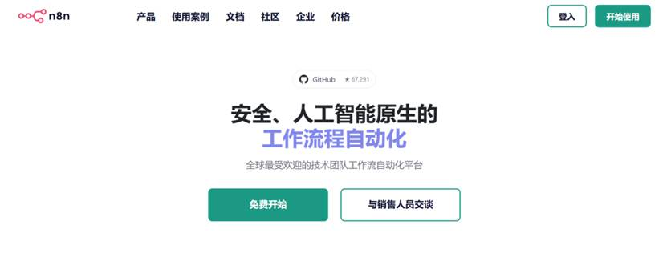
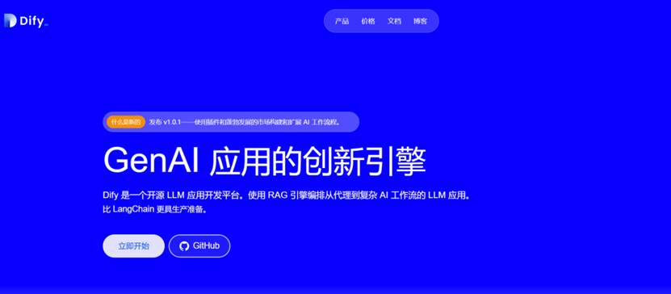
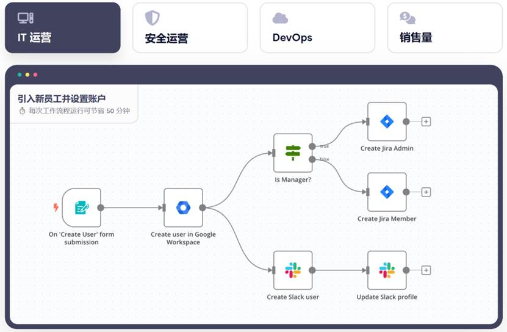
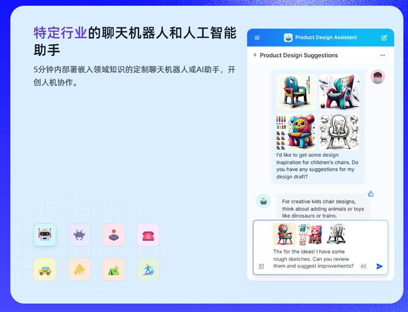
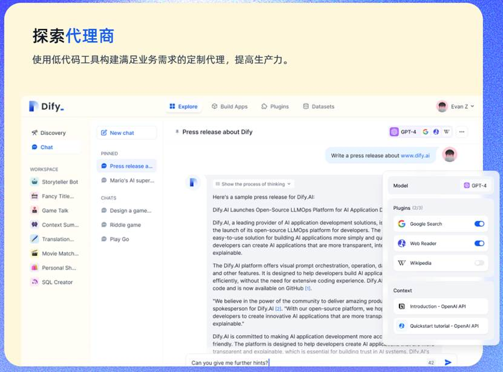
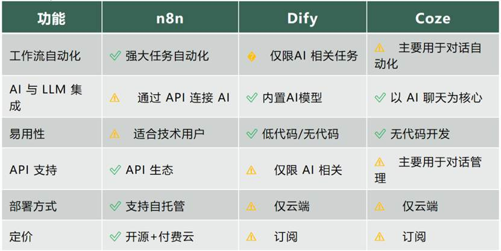
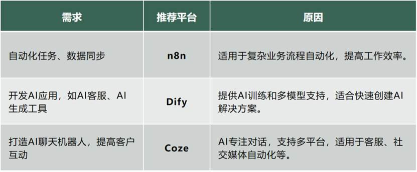

如果你希望三分钟就搭建一个企业对外服务的工具

那这篇文章不适合<o:p></o:p>

如果你希望搭建一个真正长期使用的智能体等<o:p></o:p>

这篇是适合的<o:p></o:p>

目录<o:p></o:p>

1. 简介<o:p></o:p>

2. 各平台概述<o:p></o:p>

2.1 n8n：工作开源流自动化<o:p></o:p>

2.2 dify：AI应用开发与部署<o:p></o:p>

2.3 Coze：人工智能聊天机器人和自动化平台<o:p></o:p>

3. 主要功能比较<o:p></o:p>

3.1 工作流自动化<o:p></o:p>

3.2 AI 与 LLM 集成<o:p></o:p>

3.3 易用性<o:p></o:p>

3.4 可扩展性和API支持<o:p></o:p>

3.5 部署和托管选项<o:p></o:p>

3.6 定价和许可<o:p></o:p>

4使用案例和理想用户<o:p></o:p>

4.1 n8n：自动处理任务和数据，提高工作效率<o:p></o:p>

4.2 Dify：快速创建AI应用，让AI辅助决策<o:p></o:p>

4.3 Coze：搭建智能客服，自动回复消息<o:p></o:p>

5. 各平台的优缺点<o:p></o:p>

5.1 n8n：工作开源流自动化<o:p></o:p>

5.2 Dify：AI 应用开发<o:p></o:p>

5.3 Coze：人工智能聊天机器人和对话自动化<o:p></o:p>

6. 为什么要选择这样的应用？<o:p></o:p>

6.1 要点<o:p></o:p>

6.2 最终建议<o:p></o:p>

7. 常见问题解答：n8n、Dify 和 Coze<o:p></o:p>

 
 
今天，我们讲三款帮助我们快速构建智能体，让工作更高效，减少重复劳动，提高业务自动化水平的工具——n8n 、Dify和Coze，它们能帮解决自动化任务执行、AI应用开发和智能对话交互三大核心需求。<o:p></o:p>

无论您是开发人员、企业用户还是AI爱好者，了解这三个平台的差异优势，能够帮助您做出最佳选择，以更好地满足业务需求。接下来，我们将深入比较它们的核心功能、应用场景以及优缺点，帮助您找到最合适的工具。<o:p></o:p>

 
<![if !supportLineBreakNewLine]> 
<![endif]><o:p></o:p>

<b>01</b><o:p></o:p>

<b>这些工具分别解决什么问题？</b><o:p></o:p>

n8n：自动化任务执行——连接多个工具，让软件之间自动协作。 
<![if !supportLineBreakNewLine]> 
<![endif]><o:p></o:p>

<!--[if gte vml 1]><v:shapetype id="_x0000_t75"
 coordsize="21600,21600" o:spt="75" o:preferrelative="t" path="m@4@5l@4@11@9@11@9@5xe"
 filled="f" stroked="f">
 <v:stroke joinstyle="miter"/>
 <v:formulas>
  <v:f eqn="if lineDrawn pixelLineWidth 0"/>
  <v:f eqn="sum @0 1 0"/>
  <v:f eqn="sum 0 0 @1"/>
  <v:f eqn="prod @2 1 2"/>
  <v:f eqn="prod @3 21600 pixelWidth"/>
  <v:f eqn="prod @3 21600 pixelHeight"/>
  <v:f eqn="sum @0 0 1"/>
  <v:f eqn="prod @6 1 2"/>
  <v:f eqn="prod @7 21600 pixelWidth"/>
  <v:f eqn="sum @8 21600 0"/>
  <v:f eqn="prod @7 21600 pixelHeight"/>
  <v:f eqn="sum @10 21600 0"/>
 </v:formulas>
 <v:path o:extrusionok="f" gradientshapeok="t" o:connecttype="rect"/>
 <o:lock v:ext="edit" aspectratio="t"/>
</v:shapetype><v:shape id="图片_x0020_9" o:spid="_x0000_i1033" type="#_x0000_t75"
 style='width:415.5pt;height:163pt;visibility:visible;mso-wrap-style:square'>
 <v:imagedata src="AI与自动化实战/image001.png" o:title=""/>
</v:shape><![endif]--><![if !vml]><![endif]><o:p></o:p>

官网地址：?
https://n8n.io/<o:p></o:p>

 
<![if !supportLineBreakNewLine]> 
<![endif]><o:p></o:p>

n8n 是一个“自动化机器人”，可以把不同的软件和应用连接在一起，自动完成重复任务。<o:p></o:p>

企业运营：定期整理财务报表并自动发送给仓库。<o:p></o:p>

电商业务：客户下单后，n8n自动记录订单，发送发货通知，并更新库存数据。<o:p></o:p>

市场营销：当你发布新产品时，n8n自动在多个社交平台（微博、微信、Facebook等）同步自动化信息。<o:p></o:p>

 
<![if !supportLineBreakNewLine]> 
<![endif]><o:p></o:p>

Dify：AI应用开发——快速创建智能AI工具，提高工作效率。<o:p></o:p>

<!--[if gte vml 1]><v:shape id="图片_x0020_8"
 o:spid="_x0000_i1032" type="#_x0000_t75" style='width:415.5pt;height:182pt;
 visibility:visible;mso-wrap-style:square'>
 <v:imagedata src="AI与自动化实战/image003.png" o:title=""/>
</v:shape><![endif]--><![if !vml]><![endif]><o:p></o:p>

官网地址：?
https://dify.ai/<o:p></o:p>

Dify是一个“AI应用开发平台”，帮助您创建AI客服、智能写作助手、自动数据分析工具等，即使不会编程，也能轻松使用主流AI模型（如GPT-4、Claude、Gemini、DeepSeek）。适用于：<o:p></o:p>

 
<![if !supportLineBreakNewLine]> 
<![endif]><o:p></o:p>

客服自动化：Dify让AI客服机器人24小时回答客户问题，减少人工客服负担。<o:p></o:p>

AI辅助写作：帮助生成产品介绍、市场推广文案、社交媒体帖子等，提高写作效率。<o:p></o:p>

智能助手：适用于法律、金融、医疗等行业，让AI帮助用户快速查找信息、分析数据。<o:p></o:p>

 
<![if !supportLineBreakNewLine]> 
<![endif]><o:p></o:p>

 
<![if !supportLineBreakNewLine]> 
<![endif]><o:p></o:p>

Coze：智能对话交互——创建AI聊天机器人，提高客户互动。<o:p></o:p>

<!--[if gte vml 1]><v:shape id="图片_x0020_7"
 o:spid="_x0000_i1031" type="#_x0000_t75" style='width:415.5pt;height:181pt;
 visibility:visible;mso-wrap-style:square'>
 <v:imagedata src="AI与自动化实战/image005.png" o:title=""/>
</v:shape><![endif]--><![if !vml]><![endif]><o:p></o:p>

官网地址：?
https://coze.com/<o:p></o:p>

Coze是一个“AI聊天助手”，可以创建智能对话机器人，部署在微信、WhatsApp、抖音、小红书、企业微信等渠道，自动回复客户问题，例如：<o:p></o:p>

电商客服：自动回答“此产品有货吗？”“现在有什么优惠？”等问题。<o:p></o:p>

社交媒体管理：自动回复粉丝留言，提升品牌互动效果。<o:p></o:p>

企业内部助理：帮助员工查询考勤、报销流程、公司政策等信息。<o:p></o:p>

接下来的章节，我们将详细介绍n8n、Dify和Coze的核心功能、使用场景、优点，帮助你找到最合适的工具，无论你是企业用户、开发者，希望利用AI提高效率的个人用户。<o:p></o:p>

<b>01</b><o:p></o:p>

<b>各平台分析</b><o:p></o:p>

在这一部分，我们将详细介绍n8n、Dify 和 Coze的核心功能及其适用场景，并用通俗易懂的语言进行解释，让没有技术背景的用户也能轻松理解它们的用途。<o:p></o:p>

<b>2.1 &nbsp;n8n——</b><b>工作开源流自动化</b><o:p></o:p>

1<o:p></o:p>

<b>什么是n8n？</b><o:p></o:p>

n8n 是一个帮助你自动完成重复性任务的工具，它可以把不同的软件和应用程序连接起来，让它们自动协作。例如，你可以让 n8n 自动帮助处理邮件、收集数据、更新表格，甚至把多个步骤连接起来形成一个完整的流程业务，而不需要人工操作。<o:p></o:p>

<!--[if gte vml 1]><v:shape id="图片_x0020_6"
 o:spid="_x0000_i1030" type="#_x0000_t75" style='width:415.5pt;height:272pt;
 visibility:visible;mso-wrap-style:square'>
 <v:imagedata src="AI与自动化实战/image007.png" o:title=""/>
</v:shape><![endif]--><![if !vml]><![endif]><o:p></o:p>

 
<![if !supportLineBreakNewLine]> 
<![endif]><o:p></o:p>

2<o:p></o:p>

<b>n8n </b><b>适用于哪些场景？</b><o:p></o:p>

社交媒体自动发布：当你发布一篇文章时，n8n
可以自动分享到微博、微信朋友圈、Twitter（推特）和 Instagram（照片社交平台）等多个社交平台。<o:p></o:p>

邮件自动回复和提醒：当客户在网站上提交咨询表单后，n8n可以自动发送确认邮件，并在24小时后发送转发邮件。<o:p></o:p>

订单管理：如果你经营一家电商小店，n8n可以自动把新订单记录到Google Sheets（Google的在线电子表格），同时发送通知到微信或者钉钉群。<o:p></o:p>

自动化：n8n可以每天定时从您的银行账户获取最新交易数据，并更新到Excel表格中，帮助财务团队更快地完成财务事务处理。<o:p></o:p>

3<o:p></o:p>

<b>&nbsp;n8n</b><b>的特点&nbsp;</b><o:p></o:p>

&#9989;免费开源：你可以自己在服务器上部署它，不需要订阅费用。<o:p></o:p>

&#9989;拖拽式界面：不用写代码，就像拼积木一样的搭建自动化工作流，新手也能轻松上手。<o:p></o:p>

&#9989;连接上百种应用：支持微信、钉钉、飞书、Gmail、Slack（团队沟通软件）、Google Drive（Google的云盘）等多种服务。<o:p></o:p>

&#9989;支持自定义代码：如果你会一些编程，还可以使用JavaScript，让自动化流程更高级。<o:p></o:p>

?简单理解：n8n就像一个超级智能助理，可以快速帮助完成各种繁琐的工作，让你踏实地管理时间。<o:p></o:p>

 
<![if !supportLineBreakNewLine]> 
<![endif]><o:p></o:p>

<b>2.2 Dify</b><b>的应用开发与部署</b><o:p></o:p>

<!--[if gte vml 1]><v:shape id="图片_x0020_5"
 o:spid="_x0000_i1029" type="#_x0000_t75" style='width:415.5pt;height:318pt;
 visibility:visible;mso-wrap-style:square'>
 <v:imagedata src="AI与自动化实战/image009.png" o:title=""/>
</v:shape><![endif]--><![if !vml]><![endif]><o:p></o:p>

 
<![if !supportLineBreakNewLine]> 
<![endif]><o:p></o:p>

1<o:p></o:p>

<b>什么是Dify？</b><o:p></o:p>

Dify 是一款让你轻松创建 AI 应用的工具，即使你不会写代码，也能用它来开发 AI 聊天机器人、AI 写作助手、AI
智能问答系统等。Dify 提供了多种 AI 模型供你选择，包括：<o:p></o:p>

<ul style='margin-top:0cm' type=disc>
 <li class=MsoNormal style='text-align:left;mso-pagination:widow-orphan;
     mso-list:l9 level1 lfo1;tab-stops:list 36.0pt'>GPT-4（OpenAI的大语言模型）<o:p></o:p></li>
 <li class=MsoNormal style='text-align:left;mso-pagination:widow-orphan;
     mso-list:l9 level1 lfo1;tab-stops:list 36.0pt'>Claude（Anthropic 开发的 AI 助手）<o:p></o:p></li>
 <li class=MsoNormal style='text-align:left;mso-pagination:widow-orphan;
     mso-list:l9 level1 lfo1;tab-stops:list 36.0pt'>Gemini（谷歌推出的人工智能模型）<o:p></o:p></li>
 <li class=MsoNormal style='text-align:left;mso-pagination:widow-orphan;
     mso-list:l9 level1 lfo1;tab-stops:list 36.0pt'>DeepSeek（来自中国的AI大模型，支持中文处理更强）<o:p></o:p></li>
</ul>

这些人工智能可以帮助你自动处理问题、生成文章、分析数据等，极大地提升工作效率。<o:p></o:p>

2<o:p></o:p>

<b>Dify</b><b> </b><b>适用于哪些场景？</b><o:p></o:p>

企业智能客服：您可以使用Dify创建一个AI客服机器人，解答客户的常见问题，比如“如何退货？”“发票怎么开？”等，减少人工客服的工作量。<o:p></o:p>

AI文案写作：Dify可以自动生成市场营销文案、广告文案、新闻稿、微博/朋友圈文案提高等，帮助内容创作者效率。<o:p></o:p>

法律、金融、医疗等专业AI助手：Dify允许企业上传自己的专属知识库，让AI变得更懂你的行业，比如让AI变成一个懂法律的助手，帮助律师快速查找法规信息。<o:p></o:p>

企业内部知识问答：大公司往往有很多内部文档，比如考勤规则、公司福利、报销流程等。Dify 可以让 AI 学习这些文档，员工只需提问，AI 就能快速提供答案。<o:p></o:p>

<!--[if gte vml 1]><v:shape id="图片_x0020_4"
 o:spid="_x0000_i1028" type="#_x0000_t75" style='width:415.5pt;height:307.5pt;
 visibility:visible;mso-wrap-style:square'>
 <v:imagedata src="AI与自动化实战/image011.png" o:title=""/>
</v:shape><![endif]--><![if !vml]><![endif]><o:p></o:p>

 
<![if !supportLineBreakNewLine]> 
<![endif]><o:p></o:p>

3<o:p></o:p>

<b>Dify</b><b>的核心特点&nbsp;</b><o:p></o:p>

&#9989;支持多种AI模型：可以自由选择GPT-4、Claude、Gemini、DeepSeek等AI大模型，满足不同需求。<o:p></o:p>

&#9989;低代码/无代码开发：不懂编程也能轻松创建AI应用，适合企业和个人使用。<o:p></o:p>

&#9989;个性化AI训练：可以上传自家公司的文档，让AI更精准解答当地行业相关问题。<o:p></o:p>

&#9989;支持云端化部署：如果企业有隐私保护需求，可以把Dify安装在自己的服务器上，保证数据安全。<o:p></o:p>

?简单理解：Dify就像一个AI工厂，让你能够快速搭建自己的AI机器人，帮助写作、提高客服、数据分析等工作效率。<o:p></o:p>

 
<![if !supportLineBreakNewLine]> 
<![endif]><o:p></o:p>

<b>2.3 Coze</b><b>的应用开发与部署</b><o:p></o:p>

1<o:p></o:p>

<b>什么是 Coze？</b><o:p></o:p>

Coze是一个专门用于打造AI聊天机器人的平台，可以让您在微信、WhatsApp（全球最流行的聊天软件）、钉钉、企业微信、网站等多个平台上部署智能客服机器人，让AI自动回复客服咨询，减轻人工客服的压力。<o:p></o:p>

 
<![if !supportLineBreakNewLine]> 
<![endif]><o:p></o:p>

<!--[if gte vml 1]><v:shape id="图片_x0020_3"
 o:spid="_x0000_i1027" type="#_x0000_t75" style='width:415.5pt;height:136.5pt;
 visibility:visible;mso-wrap-style:square'>
 <v:imagedata src="AI与自动化实战/image013.png" o:title=""/>
</v:shape><![endif]--><![if !vml]><![endif]><o:p></o:p>

 
<![if !supportLineBreakNewLine]> 
<![endif]><o:p></o:p>

2<o:p></o:p>

<b>Coze</b><b> </b><b>适用于目标场景？</b><o:p></o:p>

电商网站AI客服：当用户在电商平台咨询“这款产品有货吗？”“现在有什么优惠吗？”时，Coze机器人可以自动回复，并推荐相关产品。<o:p></o:p>

社交媒体自动回复：如果你的品牌在微博、抖音、小红书上有大量粉丝，Coze机器人可以提高帮助自动回复粉丝留言，用户互动率。<o:p></o:p>

酒店和行业AI预订助手：Coze可以帮助客户查询酒店航班信息、当地旅游旅游流程，并自动完成预订。<o:p></o:p>

企业内部智能助手：企业员工可以使用Coze AI聊天机器人来快速查询报销流程、公司政策、HR规定等，提高内部沟通效率。<o:p></o:p>

医疗咨询机器人：Coze适用于医院或在线健康平台，为患者提供基础健康咨询、预约挂号、健康科普等AI互动。<o:p></o:p>

3<o:p></o:p>

<b>Coze</b><b>的核心特点</b><o:p></o:p>

&#9989;无代码/低代码开发：普通用户也能轻松搭建AI聊天机器人，不需要写代码。<o:p></o:p>

&#9989;支持多平台：可在微信、WhatsApp、钉钉、企业微信、网站等多个平台部署，覆盖更广的用户群体。<o:p></o:p>

&#9989;智能NLP（自然语言处理）：能理解客户问题，并提供精准解答，提升客户满意度。<o:p></o:p>

&#9989;最后自动化服务：AI机器人24小时在线，无论是夜间还是深夜，都能解答客户问题。<o:p></o:p>

&#9989;支持自定义知识库：企业可以上传产品手册、常见问题，让AI机器人更懂你的业务。<o:p></o:p>

?简单理解：Coze就像一个AI智能客服，可以24小时在线，自动回复客户，减少人工客服的工作量，沟通效率。<o:p></o:p>

 
<![if !supportLineBreakNewLine]> 
<![endif]><o:p></o:p>

<b>03</b><o:p></o:p>

<b>主要功能比较</b><o:p></o:p>

 
<![if !supportLineBreakNewLine]> 
<![endif]><o:p></o:p>

<!--[if gte vml 1]><v:shape id="图片_x0020_2"
 o:spid="_x0000_i1026" type="#_x0000_t75" style='width:415.5pt;height:208.5pt;
 visibility:visible;mso-wrap-style:square'>
 <v:imagedata src="AI与自动化实战/image015.png" o:title=""/>
</v:shape><![endif]--><![if !vml]><![endif]><o:p></o:p>

 
<![if !supportLineBreakNewLine]> 
<![endif]><o:p></o:p>

<b>04</b><o:p></o:p>

<b>使用案例和理想用户</b><o:p></o:p>

在本章节中，我们将详细介绍n8n、Dify 和 Coze在不同场景下的应用，并分别分析最适合的用户群体，帮助您更清楚地判断哪款工具适合您的需求。<o:p></o:p>

 
<![if !supportLineBreakNewLine]> 
<![endif]><o:p></o:p>

<b>4.1 n8n</b><b>：自动处理任务和数据，提高工作效率</b><o:p></o:p>

<b>适用场景：</b>n8n适用于需要高自由度的自动化工作流，帮助开发人员和技术用户连接不同的软件和系统，让他们自动协作。特别是适用于：<o:p></o:p>

 
<![if !supportLineBreakNewLine]> 
<![endif]><o:p></o:p>

企业流程自动化：连接多个企业系统，实现自动传输，如自动化订单处理、财务报表生成。<o:p></o:p>

市场营销自动化：新文章发布时，自动同步到社交媒体（微博、微信、Facebook）。<o:p></o:p>

IT运维自动化：监控服务器状态，异常时自动发送警报或执行修复任务。<o:p></o:p>

数据整合与同步：将CRM、ERP、数据库、Google Sheets进行数据自动更新。<o:p></o:p>

 
<![if !supportLineBreakNewLine]> 
<![endif]><o:p></o:p>

<b>理想用户：</b><o:p></o:p>

&#9989;开发人员、工程师：需要脚本和 API 集成，创建复杂的自动化任务。<o:p></o:p>

&#9989;企业 IT 团队：希望提升工作流自动化能力，提高系统协作效率。<o:p></o:p>

&#9989;数据分析师：需要整合多个数据源，自动收集、处理和存储数据。<o:p></o:p>

<b>4.2 Dify</b><b>：快速创建AI应用，让AI辅助决策</b><o:p></o:p>

<b>适用场景：</b>Dify 适用于需要利用 AI 技术提升业务效率和创造智能应用的企业和开发者。特别是适用于：<o:p></o:p>

企业AI客服：创建AI聊天机器人，7×24小时自动回复客户，降低人工客服成本。<o:p></o:p>

内容生成：自动撰写市场营销文案、社交媒体内容、新闻稿等，提高生产力。<o:p></o:p>

企业内部AI助手：让员工可以通过AI查询公司政策、产品数据等，提高工作效率。<o:p></o:p>

智能推荐系统：帮助电商平台根据用户行为推荐合适的产品。<o:p></o:p>

 
<![if !supportLineBreakNewLine]> 
<![endif]><o:p></o:p>

<b>理想用户：</b><o:p></o:p>

&#9989;产品经理、运营人员：需要通过AI提升业务，但没有技术背景。<o:p></o:p>

&#9989;企业和部分公司：希望快速部署AI方案，如AI客服、AI写作助手等。<o:p></o:p>

&#9989;开发人员：需要将AI功能集成到应用中，并使用GPT-4、Claude、DeepSeek等大模型。<o:p></o:p>

<b>4.3 Coze</b><b>：搭建智能客服，自动回复消息</b><o:p></o:p>

<b>适用场景：</b>Coze 适用于需要构建 AI 聊天机器人，提高客户互动和自动化客服的企业和业务。特别适用于：<o:p></o:p>

智能客服：企业可以使用Coze在微信、WhatsApp、网站上部署聊天机器人，自动回复客户问题。<o:p></o:p>

社交媒体互动：自动回复用户留言，提高品牌曝光率和互动效果。<o:p></o:p>

电商AI助手：在淘宝、京东、小红书等平台提供智能产品推荐，提高转化率。<o:p></o:p>

企业内部问答机器人：帮助员工查询考勤、报销、公司政策等信息。<o:p></o:p>

 
<![if !supportLineBreakNewLine]> 
<![endif]><o:p></o:p>

<b>理想用户：</b><o:p></o:p>

&#9989;电商、品牌方：需要24小时客服，提升客户转化率。<o:p></o:p>

&#9989;社交媒体运营：希望自动回复粉丝，提高用户互动和体验。<o:p></o:p>

&#9989;企业HR、行政团队：AI机器人帮助员工快速获取公司信息，提高内部效率。<o:p></o:p>

 
<![if !supportLineBreakNewLine]> 
<![endif]><o:p></o:p>

<b>05</b><o:p></o:p>

<b>各平台的优缺点分析</b><o:p></o:p>

在本章节中，我们将分析n8n、Dify 和 Coze的主要优点，帮助您做出更明智的选择。<o:p></o:p>

 
<![if !supportLineBreakNewLine]> 
<![endif]><o:p></o:p>

<b>5.1 n8n</b><b>：工作开源流自动化</b><o:p></o:p>

&#9989;优点<o:p></o:p>

<ul style='margin-top:0cm' type=disc>
 <li class=MsoNormal style='text-align:left;mso-pagination:widow-orphan;
     mso-list:l1 level1 lfo2;tab-stops:list 36.0pt'>免费开源：支持自托管，支付订阅费用。<o:p></o:p></li>
 <li class=MsoNormal style='text-align:left;mso-pagination:widow-orphan;
     mso-list:l1 level1 lfo2;tab-stops:list 36.0pt'>高度可定制：可以编写脚本，满足复杂的业务需求。<o:p></o:p></li>
 <li class=MsoNormal style='text-align:left;mso-pagination:widow-orphan;
     mso-list:l1 level1 lfo2;tab-stops:list 36.0pt'>支持广泛的API：可以连接Google Sheets、数据库、邮件系统等多种应用。<o:p></o:p></li>
 <li class=MsoNormal style='text-align:left;mso-pagination:widow-orphan;
     mso-list:l1 level1 lfo2;tab-stops:list 36.0pt'>自动化能力强：支持多步骤工作流程，从简单的任务到复杂的企业流程亟需实现。<o:p></o:p></li>
</ul>

&#10060;缺点<o:p></o:p>

<ul style='margin-top:0cm' type=disc>
 <li class=MsoNormal style='text-align:left;mso-pagination:widow-orphan;
     mso-list:l4 level1 lfo3;tab-stops:list 36.0pt'>需要一定的技术背景：虽然有可视化界面，但高级功能需要编程知识。<o:p></o:p></li>
 <li class=MsoNormal style='text-align:left;mso-pagination:widow-orphan;
     mso-list:l4 level1 lfo3;tab-stops:list 36.0pt'>需要维护服务器：自托管版本需要IT负责团队部署和维护。<o:p></o:p></li>
</ul>

 
<![if !supportLineBreakNewLine]> 
<![endif]><o:p></o:p>

<b>5.2 Dify</b><b>：AI 应用开发</b><o:p></o:p>

&#9989;优点<o:p></o:p>

<ul style='margin-top:0cm' type=disc>
 <li class=MsoNormal style='text-align:left;mso-pagination:widow-orphan;
     mso-list:l8 level1 lfo4;tab-stops:list 36.0pt'>低代码/无代码：适合非技术用户，拖拽式开发，无需编程经验。<o:p></o:p></li>
 <li class=MsoNormal style='text-align:left;mso-pagination:widow-orphan;
     mso-list:l8 level1 lfo4;tab-stops:list 36.0pt'>内置AI大模型：支持GPT-4、Claude、Gemini、DeepSeek，可灵活选择AI引擎。<o:p></o:p></li>
 <li class=MsoNormal style='text-align:left;mso-pagination:widow-orphan;
     mso-list:l8 level1 lfo4;tab-stops:list 36.0pt'>企业级AI方案：适合AI客服、智能推荐、AI生成内容等业务场景。<o:p></o:p></li>
</ul>

&#10060;缺点<o:p></o:p>

<ul style='margin-top:0cm' type=disc>
 <li class=MsoNormal style='text-align:left;mso-pagination:widow-orphan;
     mso-list:l3 level1 lfo5;tab-stops:list 36.0pt'>仅支持云部署：企业数据无法自托管，需依赖Dify的云服务。<o:p></o:p></li>
 <li class=MsoNormal style='text-align:left;mso-pagination:widow-orphan;
     mso-list:l3 level1 lfo5;tab-stops:list 36.0pt'>AI计算资源需付费：使用AI模型会产生额外费用，成本需考虑。<o:p></o:p></li>
</ul>

 
<![if !supportLineBreakNewLine]> 
<![endif]><o:p></o:p>

<b>5.3 Coze</b><b>：人工智能聊天机器人和对话自动化</b><o:p></o:p>

&#9989;优点<o:p></o:p>

<ul style='margin-top:0cm' type=disc>
 <li class=MsoNormal style='text-align:left;mso-pagination:widow-orphan;
     mso-list:l6 level1 lfo6;tab-stops:list 36.0pt'>无代码开发：适合所有用户，无需技术背景即可打造AI机器人。<o:p></o:p></li>
 <li class=MsoNormal style='text-align:left;mso-pagination:widow-orphan;
     mso-list:l6 level1 lfo6;tab-stops:list 36.0pt'>支持多渠道：可在微信、WhatsApp、小红书、企业微信等多个平台部署。<o:p></o:p></li>
 <li class=MsoNormal style='text-align:left;mso-pagination:widow-orphan;
     mso-list:l6 level1 lfo6;tab-stops:list 36.0pt'>7×24小时客服：提供最大自动回复，提高客户满意度。<o:p></o:p></li>
</ul>

&#10060;缺点<o:p></o:p>

<ul style='margin-top:0cm' type=disc>
 <li class=MsoNormal style='text-align:left;mso-pagination:widow-orphan;
     mso-list:l7 level1 lfo7;tab-stops:list 36.0pt'>主要面向对话AI：不用于非对话类AI任务（如AI生成、数据分析）。<o:p></o:p></li>
 <li class=MsoNormal style='text-align:left;mso-pagination:widow-orphan;
     mso-list:l7 level1 lfo7;tab-stops:list 36.0pt'>云端依赖：无法本地部署，所有数据存储都在 Coze 服务器上。<o:p></o:p></li>
</ul>

<b>06</b><o:p></o:p>

<b>为什么要选择这些工具？</b><o:p></o:p>

在选择n8n、Dify和Coze之前，您需要明确自己的业务需求。这三款工具分别针对不同的应用场景，帮助企业或个人实现自动化、AI应用开发和智能对话交互。<o:p></o:p>

<b>6.1 </b><b>要点——不同需求下的最佳选择</b><o:p></o:p>

 
<![if !supportLineBreakNewLine]> 
<![endif]><o:p></o:p>

<!--[if gte vml 1]><v:shape id="图片_x0020_1"
 o:spid="_x0000_i1025" type="#_x0000_t75" style='width:415.5pt;height:172pt;
 visibility:visible;mso-wrap-style:square'>
 <v:imagedata src="AI与自动化实战/image017.png" o:title=""/>
</v:shape><![endif]--><![if !vml]><![endif]><o:p></o:p>

 
<![if !supportLineBreakNewLine]> 
<![endif]><o:p></o:p>

<b>6.2 </b><b>选择的建议</b><o:p></o:p>

<ul style='margin-top:0cm' type=disc>
 <li class=MsoNormal style='text-align:left;mso-pagination:widow-orphan;
     mso-list:l2 level1 lfo8;tab-stops:list 36.0pt'><b>需要自动化任务？选择 n8n。</b><o:p></o:p></li>
</ul>

如果您希望将日常重复性任务自动化，例如邮件处理、数据同步、订单管理等，n8n 是您的最佳选择。<o:p></o:p>

<ul style='margin-top:0cm' type=disc>
 <li class=MsoNormal style='text-align:left;mso-pagination:widow-orphan;
     mso-list:l5 level1 lfo9;tab-stops:list 36.0pt'><b>想要低代码创建AI应用？选择Dify。</b><o:p></o:p></li>
</ul>

如果您需要快速开发AI应用，如智能客服、AI生成工具、智能推荐系统，Dify提供现成的AI模型和低代码开发工具，让您无技术背景也能上手。<o:p></o:p>

<ul style='margin-top:0cm' type=disc>
 <li class=MsoNormal style='text-align:left;mso-pagination:widow-orphan;
     mso-list:l0 level1 lfo10;tab-stops:list 36.0pt'><b>需要智能客服或AI交互机器人？选择Coze。</b><o:p></o:p></li>
</ul>

如果您的业务需要AI机器人与用户对话，比如自动回复客户消息、提升社交媒体互动时间、提供24小时在线客服，Coze是最适合的选择。<o:p></o:p>

<b>07</b><o:p></o:p>

<b>常见问题解答：n8n、Dify 和 Coze</b><o:p></o:p>

<b>1. n8n</b><b>、Dify 和 Coze 之间的主要区别是什么？</b><o:p></o:p>

答：n8n主要用于工作流自动化，适合连接多个应用，实现数据同步、任务自动化等。<o:p></o:p>

Dify主要用于AI应用开发，适合企业构建AI客服、AI生成内容、智能推荐等AI任务。<o:p></o:p>

Coze主要面向智能聊天机器人，适合企业部署人工智能客服、社交媒体互动等自动化对话应用。<o:p></o:p>

<b>2. </b><b>哪个平台最适合非技术用户？</b><o:p></o:p>

答：Dify 和 Coze更适合非技术用户，提供无代码/低代码开发，无编程经验即可使用。<o:p></o:p>

n8n适合技术用户，需要一定的 API 和脚本知识来创建复杂的自动化流程。<o:p></o:p>

<b>3.</b><b>我可以使用n8n进行AI应用吗？</b><o:p></o:p>

答：可以，但n8n主要是自动化工具，如果想要集成AI功能，需要通过API连接GPT-4、Claude、DeepSeek等AI模型。<o:p></o:p>

<b>4. Coze</b><b>可以用于哪些行业？</b><o:p></o:p>

答：适用于电商、企业客服、社交媒体管理、金融服务、在线教育等场景，帮助企业实现自动化沟通、智能客服、信息查询等AI交互功能。<o:p></o:p>

<b>5. </b><b>哪个平台最适合中小企业？</b><o:p></o:p>

答：Dify 和 Coze适合中小企业，可以快速部署 AI 解决方案，消去庞大的 IT 团队，帮助企业降低运营成本，提高效率。<o:p></o:p>

<o:p>&nbsp;</o:p>

